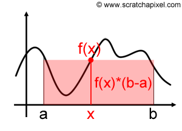

```{r, cache=FALSE, include=FALSE}
source("setup_knitr.R")
opts_chunk$set(fig.path = "figures/MC_intro/")
```

> *Monte Carlo methods are experiments.*

> Gentle, J. (2009)

# Introdução

Duas grandes classes de problemas numéricos que surgem na inferência
estatística são: problemas de **otimização**, e problemas de
**integração**. De fato, diversos exemplos mostram que nem sempre é
possível calcular analiticamente os estimadores associados à um
determinado paradigma (máxima verossimilhança, bayesiano, método dos
momentos, etc).

Experimentação de Monte Carlo significa o uso de valores aleatórios para
a estimação de alguma função de uma distribuição de probabilidade. Um
problema que não possui um componente estocástico pode ser colocado como
um problema com um componente que pode ser identificado como a esperança
de uma função de uma variável aleatória (VA). Isso pode ser feito
através da decomposição de uma função densidade de probabilidade. O
problema é então resolvido pela estimação do valor esperado por meio do
uso de uma amostra aleatória da distribuição da VA.

O termo "Método de Monte Carlo" surgiu no laboratório nacional de Los
Alamos (EUA), no final dos anos 1940, durante o desenvolvimento de uma
bomba atômica (Metropolis e Ulam, 1949). O termo "Monte Carlo" faz
referência à cidade famosa por seus cassinos, que fazem uso de
mecanismos "aleatórios" para jogos. O desenvolvimento destes métodos
também contribuíram fortemente para o desenvolvimento dos primeiros
computadores eletrônicos, acelarando a computação de tarefas numéricas
repetitivas.

Não existe um consenso em como os métodos de Monte Carlo poderiam ser
definidos, mas algumas distinções podem ser feitas:

- **Simulação**: Sortear **um** valor de uma $U(0,1)$ pode simular o
  lançamento de uma moeda: se for menor do que 0.5, atribua cara, caso
  contrário, coroa.
- **Método de Monte Carlo**: Derramar uma caixa de moedas em uma mesa e
  calcular a proporção de moedas que caem cara ou coroa.
- **Simulação de Monte Carlo**: Sortear um grande número de valores de
  uma $U(0,1)$ e atribuir cara (menor que 0.5) ou coroa.

Os métodos de Monte Carlo também podem ser divididos em duas categorias:

- **Integração** de Monte Carlo: quando utilizado para resolver
  problemas de integração numérica
- **Simulação** de Monte Carlo: quando utilizado para resolver problemas
  mais gerais através de simulação

# Integração de Monte Carlo

A integração de Monte Carlo é uma técnica numérica que se baseia em
amostragem aleatória para **aproximar** um resultado, aplicando esse
processo para a estimação numérica de integrais.

De maneira geral, um probelma de inferência estatística pode ser
formulado como a estimação de uma integral do tipo
$$
\theta = \int_{D} h(x) \text{d}x
$$
Se a integral possui forma fechada, então não há necessidade de qualquer
método de aproximação. Caso não seja possível resolver a integral de
forma analítica, e se $D$ for de uma ou duas dimensões, então existem
diversos métodos de **quadratura** para aproximar o valor dessa
integral. Por exemplo:

- Método trapezoidal
- Método de Simpson 1/3
- Quadratura de Gauss-Hermite
- Aproximação de Laplace

No entanto, quando a dimensão em $D$ for alta, a integração de Monte
Carlo é uma alternativa mais viável (que pode ser usada em problemas de
baixa dimensão também).

Se a função $h$ for decomposta de forma a ter um componente que é uma
densidade de probabilidade, ou seja,
$$
h(x) = g(x)f(x)
$$
onde $\int_{D} f(x) dx = 1$ e $f(x) \geq 0$, então a integral $\theta$
pode ser vista como a esperança da VA $Y = g(x)$, onde $X$ tem
distribuição $f(x)$, ou seja,
$$
\theta = \text{E}[g(X)] = \int_{D} g(x)f(x) dx.
$$
Com uma amostra aleatória $x_1, \ldots, x_m$ da distribuição $f(x)$ da
VA $X$, então uma estimativa **não viesada** de $\theta$ é a média
amostral
$$
\hat\theta = \frac{1}{m} \sum_{i=1}^{m} g(x_i)
$$

Essa técnica é usada em muitas situações em estatística. Resumindo,
temos os seguintes passos:

1. Decomponha a função de interesse para incluir uma função densidade de
   probabilidade.
2. Identifique o valor esperado.
3. Use uma amostra aleatória para estimar o valor esperado.

**Note então que, na integração de Monte Carlo, trocamos um problema de
resolver uma integral por um problema de calcular uma média (por
simulação).**

## Integração simples de Monte Carlo

Considere o problema de estimar
$$
\theta = \int_0^1 g(x) dx.
$$
Se $X_1, \ldots, X_m$ é uma amostra aleatória de $U(0,1)$, então
$$
\hat\theta = \frac{1}{m} \sum_{i=1}^{m} g(x_i)
$$
Pode-se mostrar que $\hat\theta$ converge para $\text{E}[\hat\theta] =
\theta$ quando $m \to \infty$ com probabilidade 1, pela **Lei Forte dos
Grandes Números**.

<div class="panel panel-primary">
<div class="panel-heading">Lei forte dos grandes números</div>
<div class="panel-body">
Sejam $X_1, \ldots, X_n$ VAs iid com $\text{E}[X] = \mu$ e
$\text{Var}[X] = \sigma^2$, e definimos $\bar{X}_n =
\frac{1}{n}\sum_{i=1}^n X_i$. Então, para cada $\epsilon > 0$,
$$
P(\lim_{n \to \infty} |\bar{X}_n - \mu| < \epsilon) = 1
$$
isto é, converge quase certamente para $\mu$.
</div>
</div>

Por exemplo, obtenha uma estimativa de
$$
\theta = \int_0^1 e^{-x} dx
$$

```{r}
## Obtem m valores da U(0,1)
m <- 10000
x <- runif(m)
## Calcula g(x)
theta.hat <- exp(-x)
## Calcula a média
(m.theta.hat <- sum(theta.hat)/m)
```

Nesse caso, podemos obter a solução analítica e integração numérica no R
para comparar as estimativas

```{r}
## Solução analítica
(theta <- 1 - exp(-1))
## Integração numérica no R
integrate(function(x) exp(-x), lower = 0, upper = 1)
```

Um caso mais geral é estimar a integral do tipo
$$
\theta = \int_a^b g(x) dx
$$
Nesse caso, temos que substituir a $U(0,1)$ por alguma outra densidade
com suporte no intervalo dos limites de integração. Por exemplo, se $X
\sim U(a,b)$, então $f(x) = \frac{1}{b-a}$ e

\begin{align*}
\theta &= \int_a^b g(x) f(x) dx \\
  &= (b-a) \int_a^b g(x) \frac{1}{b-a} dx \\
  &= (b-a) \text{E}[g(X)]
\end{align*}

Visualmente, temos a seguinte situação:




O que temos, na verdade, é a soma de $m$ áreas de retângulos, que no
final, tendem a reproduzir a área da função desejada.

```{r, echo=FALSE, out.width='90%'}
knitr::include_graphics("img/MCIntegration03.png")
```
(Figuras extraídas de https://www.scratchapixel.com).

De maneira geral, para calcular $\theta = \int_a^b g(x) dx$:

1. Gere $X_1, \ldots, X_m$ de $U(a,b)$
2. Calcule $\overline{g(x)} = \frac{1}{m}\sum_{i=1}^{m} g(x_i)$
3. $\hat\theta = (b-a)\overline{g(x)}$

Por exemplo, obtenha uma estimativa de
$$
\theta = \int_2^4 e^{-x} dx
$$

```{r}
## Obtem m valores da U(2,4)
m <- 10000
a <- 2; b <- 4
x <- runif(m, min = a, max = b)
## Calcula g(x)
theta.hat <- exp(-x)
## Calcula a média * (b - a)
(m.theta.hat <- (sum(theta.hat)/m) * (b - a))
```

Nesse caso, podemos obter a solução analítica e integração numérica no R
para comparar as estimativas

```{r}
## Solução analítica
(theta <- exp(-2) - exp(-4))
## Integração numérica no R
integrate(function(x) exp(-x), lower = 2, upper = 4)
```

Vemos que, nos dois casos acima, estamos na verdade obtendo uma
estimativa das probabilidades $P[0<X<1]$ e $P[2<X<4]$, respectivamente.

No entanto, se quisermos calcular a seguinte probabilidade
$$
P[X>2] = \int_2^{\infty} e^{-x} dx
$$

Nesse caso, a integração simples de Monte Carlo não é útil, pois não é
possível que o limite de integração seja indefinido.

Na verdade, podemos pensar em uma aproximação **grosseira**, supondo que
vamos amostrar de $X \sim \text{U}(2, \infty)$, onde podemos aproximar o
valor de $\infty$ por um número grande. Por exemplo:

```{r}
## Obtem m valores da U(2,Inf)
m <- 10000
x2 <- runif(m, min = 2, max = 1e5)
## Calcula g(x)
theta.hat2 <- exp(-x2)
## Calcula a média * (b - a)
(m.theta.hat2 <- (sum(theta.hat2)/m) * (1e5 - 2))
## Solução analítica
(theta2 <- exp(-2) - exp(-1e5))
## Usando a exponencial
pexp(2, 1, lower.tail = FALSE)
```

Note que o valor estimado nesse caso está longe do velor correto, pois
estamos adotando um procedimento completamente arbitrário.

## Variância do estimador de Monte Carlo

Como $\hat\theta$ é resultado de uma amostra aleatória de $m$ valores,
naturalmente, cada amostra poderá gerar uma estimativa (razoavelmente)
diferente, e sempre existirá uma variabilidade dos valores amostrados ao
redor da média, que é o $\hat\theta$.

A variância de $\hat\theta$ é
$$
\hat{V}(\hat\theta) = \frac{\sigma^2}{m} =
\frac{\sum_{i=1}^m [g(x_i) - \overline{g(x)}]^2}{m^2}
$$
Portanto, o erro padrão da estimativa será
$$
\hat{EP}(\hat\theta) = \frac{\hat\sigma}{\sqrt{m}} =
\frac{\sqrt{\sum_{i=1}^m [g(x_i) - \overline{g(x)}]^2}}{m}
$$

Seguindo o exemplo anterior, vimos que a estimativa da integral é

```{r}
m.theta.hat
```

Mas veja que existe uma distribuição de valores para compor esta
estimativa média

```{r}
hist(theta.hat); abline(v = theta, col = 2)
```

A variância relacionada ao estimador pode então ser calculada como

```{r}
## Variancia
(v.theta.hat <- sum((theta.hat - m.theta.hat)^2)/m^2)
## Erro padrão
(se.theta.hat <- sqrt(v.theta.hat))
```

Pelo Teorema do Limite Central, temos que

$$
\frac{\hat\theta - \text{E}(\hat\theta)}{\sqrt{\hat{V}(\hat\theta)}}
$$
converge em distribuição para $N(0,1)$ quando $m \to \infty$. Portanto,
para $m$ suficientemente grande, $\hat\theta$ é aproximadamente Normal
com média $\theta$.

```{r}
## Simula 1000 médias
r <- 1000
res <- matrix(runif(m * r, a, b), nrow = m, ncol = r)
m.theta.sim <- apply(res, 2, function(x) mean(exp(-x)) * (b - a))
hist(m.theta.sim); abline(v = theta, col = 2)
```

Com esse resultado, podemos inclusive fornecer um intervalo de confiança
associado à nossa estimativa

```{r}
## Media e veriancia
c(m.theta.hat, v.theta.hat)
## Intervalo de confiança (95%)
c(m.theta.hat - 1.96 * se.theta.hat, m.theta.hat + 1.96 * se.theta.hat)
```

Veja que assintoticamente, i.e., conforme aumentamos o tamanho da
amostra, o valor da integral se aproxima cada vez mais do valor
verdadeiro (que nesse caso sabemos calcular analiticamente, apenas para
comparação).

```{r}
## Simula a convergência para o verdadeiro valor conforme aumenta o
## tamanho da amostra
nsamp <- 1e4
set.seed(19)
x <- exp(-runif(nsamp, a, b))
estint <- (cumsum(x) * (b - a))/(1:nsamp)
esterr <- sqrt(cumsum((x - estint)^2))/(1:nsamp)
plot(estint, ylim = c(.05, .15), type = "l",
     xlab = "Tamanho da amostra", ylab = "Estimativa")
abline(h = theta, col = 2)
lines(estint - 1.96 * esterr, lty = 2)
lines(estint + 1.96 * esterr, lty = 2)
```

## Redução da variância

Note que, embora a variância do estimador do exemplo anterior pareça
pequena, o método simples de Monte Carlo não é o método mais eficiente,
ou seja, aquele que provê estimativas com a menor variância possível.
Isso porque, como vimos, estamos supondo uma distribuição Uniforme no
intervalo $(a,b)$, para qualquer que seja o formato da função que temos
interesse em integrar.

A redução da variância é importante pois sempre estamos interessados em
obter estimativas que sejam mais precisas possíveis, evitando erros
numéricos ou de aproximações.

Existem várias adaptações para o método simples de Monte Carlo, com a
intenção de se obter estimativas mais precisas, i.e., com menor
variância. Alguns deles são:

- Variáveis antitéticas
- Variáveis de controle
- Amostragem por importância

## Amostragem por importância

Limitações do método simples de Monte Carlo:

1. Não se aplica para intervalos não definidos
2. É ineficiente quando a função $g(x)$ não é uniforme

Quando consideramos um problema de integração como um problema de valor
esperado, é natural que consideremos outras funções de densidade além da
Uniforme. Isso leva à um método mais geral chamdo de **amostragem por
importância**.

A amostragem por importância reduz a variância pelo fato de podermos
escolher uma densidade $f(x)$ mais parecida com com a função $g(x)$
sendo integrada. Ao escolher uma densidade mais parecida, a variância é
reduzida. Intuitivamente, a amostragem por importância tende a gerar
mais amostra onde a contribuição para a integral é maior, ou
"importante". Se pudermos determinar as regiões mais importantes para a
integração, a variância do estimador de Monte Carlo pode ser
significativamente reduzida.

```{r, echo=FALSE, out.width='50%'}
knitr::include_graphics("img/importancesampling.png")
```
(Figura extraída de https://www.scratchapixel.com).

Suponha que $X$ seja uma VA com densidade $f(x)$. Seja $Y = g(X)/f(X)$,
então
$$
\int g(x) dx = \int \frac{g(x)}{f(x)} f(x) dx = \text{E}[Y]
$$
Com isso, podemos estimar $\text{E}[Y]$ como uma integração simples de
Monte Carlo, ou seja,
$$
\frac{1}{m}\sum_{i=1}^{m} Y_i = \frac{1}{m}\sum_{i=1}^{m}
\frac{g(X_i)}{f(X_i)}
$$
onde as VAs $X_1, \ldots, X_m$ são geradas a partir da distribuição de
$f(x)$. A função $f(x)$ é chamada de **função de importância**.

No método de amostragem por importância, a variância do estimador
baseado em $Y= g(X)/f(X)$ é $\text{Var}(Y)/m$, então a variância de $Y$
deve ser pequena, conforme $m$ aumenta.

Na verdade, **a variância de $Y$ é pequena, se $Y$ for aproximadamente
constante**, o que significa que a densidade $f(x)$ deve estar "próxima"
da densidade de $g(x)$. Também é importante que a função $f(x)$ seja
fácil de simular.

**Exemplo:** Considere estimar a integral
$$
\theta = \int_0^1 \frac{e^{-x}}{1+x^2} dx
$$
pelo método de amostragem por importância. Diversas funções de
importância podem ser propostas para esse caso:

\begin{align*}
f_0(x) &= 1, \quad 0<x<1 \\
f_1(x) &= e^{-x}, \quad 0<x<\infty \\
f_2(x) &= (1+x^2)^{-1}/\pi, \quad -\infty<x<\infty \\
f_3(x) &= e^{-x}/(1-e^{-1}), \quad 0<x<1 \\
f_4(x) &= 4(1-x^2)^{-1}/\pi, \quad 0<x<1 \\
\end{align*}

Alguns detalhes:

- $f_1$ e $f_2$ possuem domínio maior, o que irá contribuir com muitos
  zeros (ineficientes)
- $f_1$ é uma Exponencial com $\lambda = 1$
- $f_2$ é uma Cauchy padrão
- $f_3$ e $f_4$ não são funções conhecidas, por isso precisamos usar o
  método da transformação integral de probabilidade para gerar números
  destas distribuições

Graficamente temos o seguinte cenário:

```{r, fig.show='hold', out.width='100%'}
x <- seq(0, 1, .01)
w <- 2
f1 <- exp(-x)
f2 <- (1 / pi) / (1 + x^2)
f3 <- exp(-x) / (1 - exp(-1))
f4 <- 4 / ((1 + x^2) * pi)
g <- exp(-x) / (1 + x^2)
par(mfrow = c(1, 2))
plot(x, g, type = "l", main = "", ylab = "g(x)",
     ylim = c(0,2), lwd = 2)
lines(x, g/g, col = 2, lwd = w)
lines(x, f1, col = 3, lwd = w)
lines(x, f2, col = 4, lwd = w)
lines(x, f3, col = 5, lwd = w)
lines(x, f4, col = 6, lwd = w)
legend("topright", legend = c("g", 0:4),
       col = 1:6, lwd = w, inset = 0.02)
plot(x, g, type = "l", main = "", ylab = "g(x)/f(x)",
     ylim = c(0,3.2), lwd = w)
lines(x, g/f1, col = 3, lwd = w)
lines(x, g/f2, col = 4, lwd = w)
lines(x, g/f3, col = 5, lwd = w)
lines(x, g/f4, col = 6, lwd = w)
legend("topright", legend = c(0:4),
       col = 2:6, lwd = w, inset = 0.02)
par(mfrow = c(1, 1))
```

```{r}
m <- 10000
theta.hat <- se <- numeric(5)
g <- function(x) {
    ## exp(-x - log(1+x^2)) * (x > 0) * (x < 1)
    exp(-x)/(1 + x^2) * (x > 0) * (x < 1)
}

x <- runif(m)     # usando f0
fg <- g(x)
theta.hat[1] <- mean(fg)
se[1] <- sd(fg)

x <- rexp(m, 1)   # usando f1
fg <- g(x) / exp(-x)
theta.hat[2] <- mean(fg)
se[2] <- sd(fg)

x <- rcauchy(m)   # usando f2
i <- c(which(x > 1), which(x < 0))
x[i] <- 2  # para evitar erros em g(x)
fg <- g(x) / dcauchy(x)
theta.hat[3] <- mean(fg)
se[3] <- sd(fg)

u <- runif(m)     # f3, pelo método da inversa
x <- - log(1 - u * (1 - exp(-1)))
fg <- g(x) / (exp(-x) / (1 - exp(-1)))
theta.hat[4] <- mean(fg)
se[4] <- sd(fg)

u <- runif(m)    # f4, pelo método da inversa
x <- tan(pi * u / 4)
fg <- g(x) / (4 / ((1 + x^2) * pi))
theta.hat[5] <- mean(fg)
se[5] <- sd(fg)
```

Os resultados das estimativas com seus erros-padrões são

```{r}
rbind(theta.hat, se/sqrt(m))
```

Os resultados indicam que $f_3$, e possivelmente $f_4$ produzem as
menores variâncias entre as funções propostas, enquanto que $f_2$ possui
a maior variância. Note que $f_0$, a uniforme, possui erro padrão maior.

Esse exemplo mostra que a função de importância que resulta na menor
variância de $Y = g(X)/f(X)$ deve ser escolhida com cuidado.


Voltando brevemente ao caso da exponencial, pela amostragem por
importância, podemos agora obter uma estimativa de $P[X > 2]$,
$$
P[X>2] = \int_2^{\infty} e^{-x} dx
$$
caso que não conseguimos usando a integração simples de Monte Carlo.

Suponha que a função de importância é uma $\text{Exp}(0.5)$. Portanto,
temos o seguinte cenário

```{r}
curve(dexp, from = 0, to = 10)
curve(dexp(x, 0.5), from = 0, to = 10, add = TRUE, col = 2)
```

Assim, podemos calcular a integral indefinida da seguinte forma:

```{r}
## Define funções
g <- function(x) exp(-x) * (x >= 2) # NOTE o domínio aqui
f <- function(x) dexp(x, 0.5) # Proposta é Exp(0.5)
## 1. Amostra da proposta
m <- 1e5
x <- rexp(m, 0.5)
## 2. Calcula a média da razão
mean(g(x)/f(x))
## Teórico
pexp(2, 1, lower.tail = FALSE)
```

```{r, eval=FALSE, include=FALSE}
teste <- contour(x = seq(0,3, length.out = 100),
                 y = seq(0,3, length.out = 100),
                 z = z1)
plot(teste)
image(teste)
contour(x = seq(0,3, length.out = 100),
                    y = seq(0,3, length.out = 100),
        z = z1)
image(x = seq(0,3, length.out = 100),
        y = seq(0,3, length.out = 100),
      z = z1)
cloud(x = seq(0,3, length.out = 100),
      y = seq(0,3, length.out = 100),
      z = z1)

z1 <- outer(seq(0,3, length.out = 100), seq(0,3, length.out = 100), g)

plot(g(seq(0,3, length.out = 100), seq(0,3, length.out = 100)))

## Integral em duas dimensões, usando integrais iteradas
g <- function(x, y) x^2 * y
## \int^0_3 \int^1_2 g(x,y) dy dx
integrate( function(y) {
    sapply(y, function(y) {
        integrate(function(x) g(x,y), 0, 3)$value
    })
}, 1, 2)

## Mesma integração por MC
ux <- runif(1e4, 0, 3)
uy <- runif(1e4, 1, 2)
## Aqui multiplica pela área do retângulo formado pelos limites
((3 - 0) * (2 - 1)) * mean(g(ux, uy))
```


```{r, eval=FALSE, include=FALSE}
## Rizzo, pg. 148
curve(exp(-x), from = 0, to = 10)
curve(exp(-x), from = 0, to = 1)

m <- 10000
x <- runif(m)
theta.hat <- exp(-x)
(m.theta.hat <- sum(theta.hat)/m)
(theta <- 1 - exp(-1))
integrate(function(x) exp(-x), lower = 0, upper = 1)

## Graficamente
hist(theta.hat)
abline(v = theta, col = 2)
var(theta.hat)
sd(theta.hat)

(v.theta.hat <- mean((theta.hat - m.theta.hat)^2)/m)
(v.theta.hat <- sum((theta.hat - m.theta.hat)^2)/m)
(se.theta.hat <- v.theta.hat/m)

## P[X < 0.5]
sum(theta.hat < 0.5)/m
pexp(0.5)
## Nao bate porque o dominio nao é o mesmo

r <- 1000
res <- matrix(runif(m * r), nrow = m, ncol = r)

m.theta.sim <- apply(res, 2, function(x) mean(exp(-x)))
str(m.theta.sim)
hist(m.theta.sim); abline(v = theta, col = 2)

## O que seria uma proposta nesse caso?
curve(exp(-x), from = 0, to = 10)
curve(exp(-x), from = 0, to = 1)
curve(dunif, from = 0, to = 1, add = TRUE, col = 2)

## Note que ao usar uma U(0,1) no denominador, o resultado é o mesmo, o
## que mostra que o método por importância é mais geral que o método
## simples
g <- function(x) exp(-x)
m <- 10000
x <- runif(m)
gf <- g(x)/dunif(x)
(m.theta.hat <- sum(gf)/m)
(theta <- 1 - exp(-1))
integrate(function(x) exp(-x), lower = 0, upper = 1)

var(gf)
(v.theta.hat <- sum((gf - m.theta.hat)^2)/m)
(se.theta.hat <- v.theta.hat/sqrt(m))


## Agora tenta usar uma função que seja mais próxima da proposta.
## NOTE que é necessário ter uma forma de amostrar diretamente dessa
## distribuição, ou usa o método da inversa.
curve(exp(-x), from = 0, to = 1)
f <- function(x) 1 - 0.5 * x * (x >= 0) * (x <= 2)
integrate(f, lower = 0, upper = 2)
curve(f, from = 0, to = 2, add = TRUE, col = 2)

## A acumulada é
## F(x) = x - x^2/4
Fx <- function(x) x - x^2/4
curve(Fx, from = 0, to = 2)
## A inversa da acumulada é
## F^{-1}(x) = 2 - \sqrt(4u)
iFx <- function(u) 2 - sqrt(4 * u)
u <- runif(10000)
xinv <- iFx(u)
plot(ecdf(xinv))
curve(Fx, from = 0, to = 2, add = TRUE, col = 2)

## Usa f(x) = 1 - 0.5x como importancia
g <- function(x) exp(-x) * (x >= 0) * (x <= 1)
m <- 10000
## Para amostrar dessa função vou usar o método da inversa
u <- runif(m)
x <- iFx(u)
gf <- g(x)/f(x)
theta.hat <- sum(gf)
(m.theta.hat <- sum(theta.hat)/m)
(theta <- 1 - exp(-1))
integrate(function(x) exp(-x), lower = 0, upper = 1)

## A variancia aqui é maior, provavelmente porque vai de 0 a 2
var(gf)
(v.theta.hat <- sum((gf - m.theta.hat)^2)/m)
(se.theta.hat <- v.theta.hat/sqrt(m))


## Agora tenta usar uma função que seja mais próxima da proposta.
## NOTE que é necessário ter uma forma de amostrar diretamente dessa
## distribuição, ou usa o método da inversa.
curve(exp(-x), from = 0, to = 1, ylim = c(0, 1))
f <- function(x) .5 - 1 * x * (x >= 0) * (x <= 1)
integrate(f, lower = 0, upper = 1)
curve(f, from = 0, to = 1, add = TRUE, col = 2)
## Teria que achar

curve(exp(-x), from = 0, to = 1, ylim = c(0, 3.5))
curve(dbeta(x, 0.5, 2), from = 0, to = 1, add = TRUE, col = 2)

g <- function(x) exp(-x) * (x >= 0) * (x <= 1)
m <- 10000
x <- rbeta(m, .5, 2)
gf <- g(x)/dbeta(x, .5, 2)
(m.theta.hat <- sum(gf)/m)
(theta <- 1 - exp(-1))
integrate(function(x) exp(-x), lower = 0, upper = 1)

var(gf)
(v.theta.hat <- sum((gf - m.theta.hat)^2)/m)
(se.theta.hat <- v.theta.hat/sqrt(m))


## Normal
m <- 10000
x <- runif(m, 0, 1e6)
theta.hat <- exp(-x^2/2)
(m.theta.hat <- sum(theta.hat)/m)

## Graficamente
hist(theta.hat)
abline(v = theta, col = 2)
var(theta.hat)

(v.theta.hat <- sum((theta.hat - m.theta.hat)^2)/m)
(se.theta.hat <- v.theta.hat/m)

## P[X < 0.5]
sum(theta.hat < 0.5)/m
pexp(0.5)
## Nao bate porque o dominio nao é o mesmo
```
